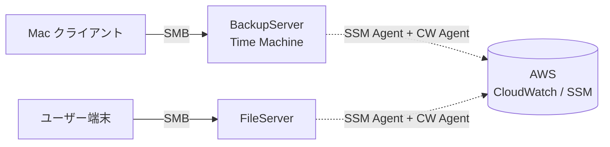

# file-servers

オンプレミスファイルサーバー (BackupServer / FileServer) を AWS と統合運用するためのリポジトリ。Ubuntu 26.04 上での構築自動化スクリプトと、メトリクス・ログ集約用 AWS インフラ (CDK) を提供する。

## Overview

オンプレミスの 2 サーバーを SSM ハイブリッドアクティベーションで AWS マネージドインスタンス化し、CloudWatch Agent でメトリクス/ログを集約する。Samba (Time Machine 対応) や rsync バックアップなど運用構成も含めてコード化している。



詳細: [docs/architecture.md](docs/architecture.md)

## Features

- **Ubuntu 26.04 セットアップ自動化** — OS 初期化 / LVM / Samba / SSM Agent / CloudWatch Agent / Docker / AWS CLI / Claude Code を冪等な setup スクリプトで導入
- **AWS インフラ (CDK)** — IAM Role と CloudWatch Dashboard を TypeScript で管理
- **USB ストレージ late-mount** — boot 時に USB が間に合わなくても、後接続で自動マウント (udev + systemd)
- **rsync バックアップジョブ** — `--checksum` で内容ハッシュ比較、flock で多重起動防止

## Quick Start

> [!IMPORTANT]
> 詳細手順は [docs/tutorials/new-server-setup.md](docs/tutorials/new-server-setup.md) を参照。

```bash
# AWS インフラのデプロイ (管理ホストで初回のみ)
cd infra/cdk
npm install
npx cdk deploy -c env=prod --all --profile FileServers

# 新サーバー (Ubuntu 26.04) のセットアップ (典型的順序)
sudo app/setup/os_init.sh BackupServer.conf
sudo app/setup/storage.sh BackupServer/timemachine.conf
sudo app/setup/auto_mount.sh BackupServer/timemachine.conf
app/setup/aws_cli.sh
sudo app/setup/ssm_agent.sh /path/to/activation-*.json
sudo app/setup/cloudwatch_agent.sh BackupServer.conf
sudo app/setup/samba.sh BackupServer.conf
```

## Project Structure

```text
file-servers/
├── app/                    # Ubuntu 26.04 用セットアップ・運用スクリプト
│   ├── setup/              # 1 回実行 (新サーバー構築時)
│   ├── jobs/               # 定期実行 (cron 等)
│   └── config/             # 各スクリプト用の設定ファイル (目的別 / サーバー別)
├── infra/cdk/              # AWS CDK v2 (TypeScript) — IAM / CloudWatch
└── docs/                   # ドキュメント (Diátaxis に従う)
```

## Documentation

| 種別 | リンク |
|---|---|
| アーキテクチャ | [docs/architecture.md](docs/architecture.md) |
| 運用 | [docs/operations.md](docs/operations.md) |
| チュートリアル (新サーバー構築) | [docs/tutorials/new-server-setup.md](docs/tutorials/new-server-setup.md) |
| How-to | [docs/how-to/](docs/how-to/) |
| リファレンス (スクリプト / 設定 / メトリクス) | [docs/reference/](docs/reference/) |
| 設計判断 (ADR) | [docs/decisions/](docs/decisions/) |
| AWS CDK 詳細 | [infra/cdk/README.md](infra/cdk/README.md) |

## Development

```bash
# シェルスクリプト構文チェック
bash -n app/setup/*.sh app/jobs/*.sh

# CDK 型チェック・テスト
cd infra/cdk
npx tsc --noEmit
npm test
```

## Security

- AWS 認証は SSO (`aws sso login --profile FileServers`)、静的キーは保管しない
- Activation Code は `app/setup/output/` に出力され、`.gitignore` で除外
- Wi-Fi パスワード等は `WIFI_PASSWORD` env / `--password-file` / 対話プロンプトのいずれかで都度供給 (リポジトリには保存しない)

## Author

NaoyaOgura
