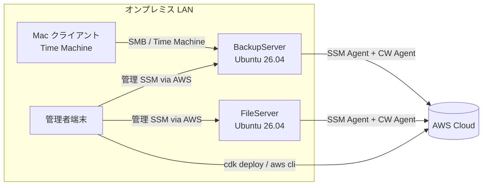
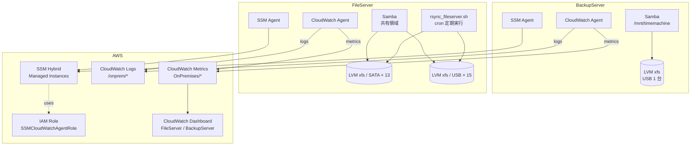
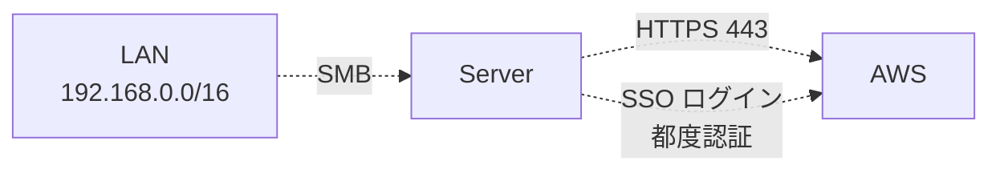

# Architecture

オンプレミスファイルサーバー × AWS の統合構成を C4 Model (Context / Container) で整理する。詳細な設計判断は [decisions/](decisions/) を参照。

## Context

| アクター / 外部 | 役割 |
|---|---|
| Mac クライアント | BackupServer 上の Time Machine 共有にバックアップを書き込む |
| 管理者端末 | CDK / AWS CLI / SSM 経由でサーバーを管理 |
| BackupServer | Time Machine 受信 (Samba 共有) を行う Ubuntu 26.04 ホスト |
| FileServer | 13 SATA + 15 USB の HDD プールを持ち、Samba でファイル提供 |
| AWS | 監視・ログ集約・運用基盤 (SSM / CloudWatch / IAM) |

## Container

### Containers (オンプレ側)

| Container | 役割 | 関連スクリプト |
|---|---|---|
| Samba (smbd / nmbd) | SMB 共有 (Time Machine / 一般ファイル) | `app/setup/samba.sh` |
| Avahi (mDNS) | macOS からの自動検出 (Time Machine) | `app/setup/samba.sh` |
| SSM Agent | AWS Systems Manager 経由のリモート管理 | `app/setup/ssm_agent.sh` |
| CloudWatch Agent | メトリクス・ログ転送 | `app/setup/cloudwatch_agent.sh` |
| LVM (xfs) | 物理ディスクを VG/LV に集約 | `app/setup/storage.sh`, `lvm_create.sh`, `lvm_extend.sh` |
| logrotate | ローカルログのローテーション | `app/setup/logrotate.sh` |
| NetworkManager | Ethernet / Wi-Fi (Wi-Fi は BackupServer のみ) | `app/setup/network.sh` |
| rsync ジョブ | FileServer ローカルバックアップ (cron) | `app/jobs/rsync_fileserver.sh` |

### Containers (AWS 側)

| Container | リソース | CDK スタック |
|---|---|---|
| IAM Role | `SSMCloudWatchAgentRole` (ハイブリッドアクティベーション用) | `fs-prod-iam-role` |
| CloudWatch Dashboard | `FileServer` / `BackupServer` | `fs-prod-cloudwatch-dashboard` |
| CloudWatch Metrics | 名前空間 `OnPremises/<Server>` | (Agent 出力先) |
| CloudWatch Logs | ロググループ `/onprem/<Server>` | (Agent 出力先) |
| SSM Activation | サーバーごとに発行 | (`app/setup/activation.sh` で動的作成) |

## Data Flow

### メトリクス / ログ
1. CloudWatch Agent が各サーバーで `/proc` と指定ログファイルを購読
2. SSM Agent 経由 (Hybrid Activation の credential) で AWS と通信
3. `OnPremises/<Server>` 名前空間にメトリクスを put
4. `/onprem/<Server>` ロググループにログを put
5. CDK 管理の Dashboard に集約表示

### Time Machine バックアップ
1. Mac → mDNS 経由で BackupServer 検出
2. SMB 認証 (NaoyaOgura ユーザー、`smbpasswd` で登録)
3. `vfs_fruit` で macOS 互換に変換され `/mnt/timemachine` に書き込み

### FileServer ローカルバックアップ
1. cron が毎時 0 分に `app/jobs/rsync_fileserver.sh` を起動
2. `flock` で多重起動を排他
3. `rsync -aHAXh --numeric-ids --stats /mnt/fileserver/ /mnt/fileserver-backup/` (mtime + size 比較で高速同期)
4. ログを `/var/log/rsync/rsync_fileserver.log` に追記
5. CloudWatch Agent がログを `rsync` ストリームに転送

> [!NOTE]
> `--checksum` (内容ハッシュ比較) は 100TB 規模で I/O 過大なため定期実行しない。
> 破損が疑われた場合のみ手動でスポット検査として `sudo .../rsync_fileserver.sh --checksum --dry-run` を実行する。
> 詳細: [ADR-007](decisions/ADR-007-rsync-no-periodic-checksum.md)

## External Dependencies

| 依存 | 用途 | 備考 |
|---|---|---|
| AWS Systems Manager | ハイブリッドアクティベーション、リモート管理 | リージョン: `ap-northeast-1` |
| AWS CloudWatch | メトリクス・ログ・ダッシュボード | 同上 |
| AWS IAM | CloudWatch Agent 用ロール | CDK 管理 |
| Docker / Ubuntu apt | Docker CE 公式 repo (`download.docker.com`) | `app/setup/docker.sh` |
| GitHub | `claude-settings` repo を `~/.claude` にクローン | `app/setup/claude.sh` |

## Security Boundaries

- **SMB アクセス**: `hosts allow = 192.168.0.0/16 127.0.0.1` で LAN 限定 (samba.sh)
- **AWS 認証**: SSO (静的アクセスキー無し)
- **SSM Agent**: ハイブリッドアクティベーションの ID/Code は 1 回限りの登録に使用、登録後は IAM Role で認証
- **Wi-Fi 認証情報**: リポジトリ非保存 (env / `--password-file` / 対話入力)

## Operational Constraints

| 観点 | 制約 |
|---|---|
| FileSystem | プロジェクト標準は **xfs** (Ubuntu 上でも) — [ADR-004](decisions/ADR-004-xfs-as-default-fs.md) |
| LVM | VG/LV の新規作成は `lvm_create.sh` で手動。`storage.sh` は検出・マウント専用 |
| USB ストレージ | boot 時に間に合わない可能性あり → fstab `nofail` + udev による late-mount で対応 ([ADR-005](decisions/ADR-005-udev-late-mount.md)) |
| 単一 PV 障害 | FileServer USB プールは 29 PV 全揃いが mount 条件 (JBOD pool 特性) |
| SMB ユーザー | 既存 admin (`NaoyaOgura`) を維持 — [ADR-003](decisions/ADR-003-naoyaogura-smb-user.md) |
| ホスト/ワークグループ命名 | FileServer/BackupServer は Ubuntu 26.04 移行を機に PascalCase hostname + `WORKGROUP` で正規化 — [ADR-006](decisions/ADR-006-onprem-server-naming-normalization.md) |
| rsync `--checksum` | 100TB 規模で I/O 過大なため定期実行しない。手動スポット検査専用 — [ADR-007](decisions/ADR-007-rsync-no-periodic-checksum.md) |

## Related Documents

- [運用](operations.md)
- [新サーバー構築チュートリアル](tutorials/new-server-setup.md)
- [スクリプトリファレンス](reference/scripts.md)
- [設定ファイルリファレンス](reference/configurations.md)
- [メトリクスリファレンス](reference/metrics.md)
- [設計判断 (ADR)](decisions/)
