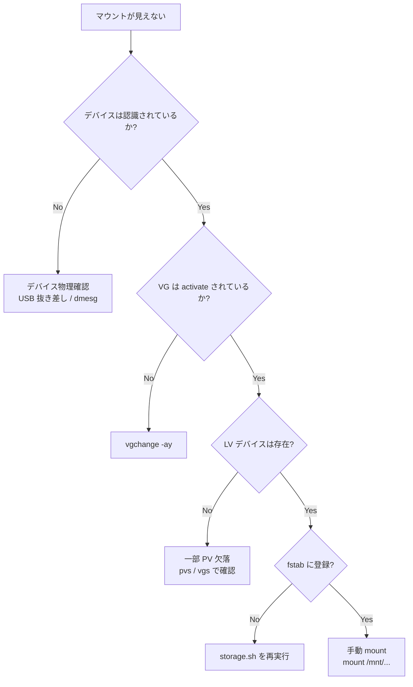

# How-to: マウント復旧

USB ストレージや LVM マウントが期待通りにならないときの復旧手順。

## 目的

`/mnt/<mount-point>` が期待通りマウントされていない場合に、原因を特定して復旧する。

## 前提条件

- root 権限
- 該当サーバー上で実行できる
- `storage.sh` と `auto_mount.sh` が事前に適用済 (詳細は [tutorials/new-server-setup.md](../tutorials/new-server-setup.md))

## 状況別フロー



## 手順

### Step 1. 現状把握

```bash
findmnt /mnt/<mount-point>     # マウント状態
lsblk -f                       # デバイス階層
sudo pvs                       # PV 一覧
sudo vgs                       # VG 一覧
sudo lvs                       # LV 一覧
sudo blkid /dev/<vg>/<lv>      # FS 種別 + UUID
dmesg | tail -50               # USB エラー等
```

### Step 2. 原因別対処

#### 2-A. USB が物理的に認識されていない

`lsblk` に `/dev/sd*` (USB 起動の場合) が出ない:

```bash
# 抜き差し or USB ハブの電源確認
dmesg -w   # 抜き差し後にイベント確認
```

#### 2-B. VG が activate されていない

```bash
sudo pvscan --cache    # PV 再スキャン
sudo vgchange -ay      # 全 VG を activate
sudo lvs               # LV が出現するか確認
```

#### 2-C. PV の一部が欠落 (FileServer USB プールで多発する)

```bash
sudo pvs                     # State 列に "missing" があるか
sudo vgs --options +pv_count,vg_missing_pv_count
```

VG が partial 状態で LV をマウントできない場合:
1. 物理的に欠けた USB を再接続 (推奨)
2. 一時的な復旧 (データロスの可能性あり、運用前に確認):
   ```bash
   sudo vgchange -ay --activationmode partial
   # 注意: partial モードは欠落セクタを含む LV になり得る
   ```

#### 2-D. LV は存在するが fstab に未登録

```bash
sudo /home/NaoyaOgura/file-servers/app/setup/storage.sh BackupServer/timemachine.conf
```

#### 2-E. fstab 登録済だが boot 時にマウントされなかった

USB enumeration が間に合わず `nofail` で skip された状態:

```bash
# 手動マウント (fstab エントリを使うのでパスのみで OK)
sudo mount /mnt/<mount-point>

# auto_mount.sh service の状態
systemctl status fileservers-automount-<vg>-<lv>.service --no-pager
journalctl -u fileservers-automount-<vg>-<lv>.service --no-pager -n 30

# udev トリガで再評価
sudo udevadm trigger --action=change --subsystem-match=block
```

### Step 3. auto_mount.sh の動作確認 (USB late-mount を使っている場合)

```bash
# udev rule の存在
ls /etc/udev/rules.d/99-fileservers-automount-*.rules

# service の存在
ls /etc/systemd/system/fileservers-automount-*.service

# udev rule から service が起動するか模擬テスト
sudo systemctl start fileservers-automount-<vg>-<lv>.service
findmnt /mnt/<mount-point>
```

### Step 4. 完全リセット (最終手段)

```bash
# auto_mount を一度削除
sudo /home/NaoyaOgura/file-servers/app/setup/auto_mount.sh BackupServer/timemachine.conf --remove

# fstab エントリを手動で確認・必要なら削除 (バックアップ取得の上)
sudo cp /etc/fstab /etc/fstab.bak.$(date +%Y%m%d-%H%M%S)
sudo vim /etc/fstab

# 再構築
sudo /home/NaoyaOgura/file-servers/app/setup/storage.sh BackupServer/timemachine.conf
sudo /home/NaoyaOgura/file-servers/app/setup/auto_mount.sh BackupServer/timemachine.conf
```

## 期待結果

- `findmnt /mnt/<mount-point>` が xfs マウントを返す
- `df -h /mnt/<mount-point>` で容量が見える
- Samba 配下からアクセスできる

## 失敗時の追加調査

| 症状 | 調査ポイント |
|---|---|
| `mount: wrong fs type` | `blkid` の TYPE と fstab の FS 種別が一致しているか |
| `mount: special device ... does not exist` | `/dev/<vg>/<lv>` シンボリックリンクの存在、`vgchange -ay` |
| boot 時に emergency mode に落ちる | fstab に `nofail` が付いているか |
| `xfs_growfs: not enough free space` | `lvs` で LV サイズが PV サイズに追従しているか |

## ロールバック

設定変更後に問題が出た場合:

```bash
# auto_mount.sh の変更を取り消す
sudo /home/NaoyaOgura/file-servers/app/setup/auto_mount.sh BackupServer/timemachine.conf --remove

# fstab を直前のバックアップから復元
sudo cp /etc/fstab.bak.<timestamp> /etc/fstab
sudo systemctl daemon-reload
```

## 注意事項

> [!CAUTION]
> `pvcreate` / `vgcreate` / `lvcreate` 系の操作は破壊的。本ガイドでは検出 + 既存マウントの復旧のみ扱う。新規作成は [tutorials/new-server-setup.md](../tutorials/new-server-setup.md) を参照。

> [!IMPORTANT]
> FileServer USB プール (29 PV) は **すべての PV 揃い**が LV マウント条件。1 台欠けたら VG が partial になり、LV はマウント不可。物理確認が最優先。

## 関連

- [Architecture](../architecture.md)
- [ADR-005: udev による late-mount](../decisions/ADR-005-udev-late-mount.md)
- [Operations](../operations.md)
