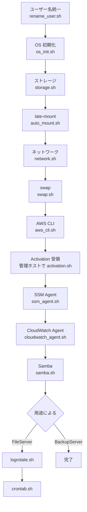

# Tutorial: 新サーバー (Ubuntu 26.04) の構築

新規 BackupServer / FileServer を Ubuntu 26.04 で構築するチュートリアル。**順序通りに実行**することで、現環境と同等の構成を再現できる。

## 対象読者

これからオンプレミス Ubuntu 26.04 サーバーをセットアップして、SSM ハイブリッド管理 + CloudWatch 監視 + Samba 提供を整える運用者。

## 前提条件

- **Ubuntu 26.04 LTS** のインストールが完了 (インストール時の admin は任意名 (例: `ubuntu`) で OK。Step 1 で `NaoyaOgura` にリネームする)
- ネットワーク疎通あり (apt および AWS エンドポイントへ HTTPS 443)
- `sudo` 権限、リポジトリ (`/home/NaoyaOgura/file-servers/`) を clone 済 (or scp で配置。リネーム前は旧 home に置く)
- 管理ホスト側で AWS CLI v2 + SSO ログイン済 (`aws sso login --profile FileServers`)
- [AWS CDK スタックがデプロイ済](../how-to/deploy-cdk.md) (`SSMCloudWatchAgentRole` が AWS に存在)

> [!CAUTION]
> 本チュートリアルは破壊的操作 (パッケージ導入・パーティション初期化・マウント点変更) を含む。本番運用中サーバーで実行しないこと。

## 全体フロー



## Step 1. ユーザー名を `NaoyaOgura` に統一

Ubuntu インストール時に作成した admin (例: `ubuntu`) を `NaoyaOgura` にリネームし、`/home/<old>` を `/home/NaoyaOgura` に移動する。Samba / SMB 共有のユーザー前提に合わせるための初期手順 ([ADR-003](../decisions/ADR-003-naoyaogura-smb-user.md))。

> [!IMPORTANT]
> 対象ユーザーがログイン中・プロセス実行中だと中止される。**別 TTY (Ctrl+Alt+F2) で root ログインするか、別の管理ユーザーから実行**すること。対象ユーザーの sudo / su セッションからは実行不可。

```bash
# 例: 別 TTY で root ログイン後、リポジトリは旧 home に clone してある前提
sudo /home/<old>/file-servers/app/setup/rename_user.sh <old>
# 例: ubuntu → NaoyaOgura
sudo /home/ubuntu/file-servers/app/setup/rename_user.sh ubuntu
```

何が起きるか:
- `usermod -l --badname` でユーザー名変更 (Ubuntu の `NAME_REGEX` は大文字非許可なので `--badname` で許可)
- primary group も同名なら `groupmod -n --badname` で改名
- `usermod -d /home/NaoyaOgura -m` で home を移動
- `/var/mail/<old>`、`/etc/sudoers.d/<old>`、`/var/spool/cron/crontabs/<old>`、`/var/lib/systemd/linger/<old>` を順次リネーム

完了後の確認:
```bash
id NaoyaOgura
ls -la /home/NaoyaOgura
getent passwd NaoyaOgura
```

> [!TIP]
> インストール時から `NaoyaOgura` を作成できている場合、本 Step はスキップ可。`id NaoyaOgura` が成功し home が `/home/NaoyaOgura` になっていれば OK。

## Step 2. OS 初期化

```bash
sudo app/setup/os_init.sh BackupServer.conf   # または FileServer.conf
```

何が起きるか: hostname / timezone / locale 設定、`apt update && upgrade`、`unattended-upgrades` 有効化、共通ツール (jq, vim, git 等) の導入。

## Step 3. ストレージ (LVM) のマウント

### 3-A. 既存 LVM ボリュームを移設してきた場合

```bash
sudo app/setup/storage.sh BackupServer/timemachine.conf
```

何が起きるか: `vgchange -ay` で既存 VG を activate、`/etc/fstab` に UUID で登録、`mount -a` で実マウント。

### 3-B. 新規 PV/VG/LV を作る場合

```bash
sudo app/setup/lvm_create.sh /dev/sdX <vg-name> <lv-name>
# 例: sudo app/setup/lvm_create.sh /dev/sdb timemachine-group timemachine
sudo app/setup/storage.sh BackupServer/timemachine.conf
```

容量を後から増やすには:
```bash
sudo app/setup/lvm_extend.sh <vg-name> <lv-name> /dev/sdY [/dev/sdZ ...]
```

### 3-C. USB ストレージの late-mount を有効化 (BackupServer / FileServer USB)

```bash
sudo app/setup/auto_mount.sh BackupServer/timemachine.conf
```

何が起きるか: `/etc/udev/rules.d/99-...rules` と `/etc/systemd/system/...service` を配置し、LV 出現時に自動マウントするようにする。詳細は [ADR-005](../decisions/ADR-005-udev-late-mount.md)。

## Step 4. ネットワーク設定 (Wi-Fi 含む)

```bash
sudo app/setup/network.sh BackupServer.conf
```

ethernet の route-metric / autoconnect を設定。Wi-Fi 設定がある場合はパスワードを聞かれる:

```
Wi-Fi password (Kure Naval District): ********
```

> [!TIP]
> 自動化したい場合は `WIFI_PASSWORD=xxx sudo -E app/setup/network.sh ...` または `--password-file <path>` (gitignore 必須)。

## Step 5. Swap セットアップ

```bash
sudo app/setup/swap.sh                # デフォルト 6GB
# または: sudo app/setup/swap.sh --size 16
```

## Step 6. AWS CLI

```bash
app/setup/aws_cli.sh                  # ユーザー権限で実行 (~/.aws/config が ~/ 直下のため)
aws sso login --profile FileServers   # 初回認証 (ブラウザが開く)
aws sts get-caller-identity --profile FileServers
```

## Step 7. SSM ハイブリッドアクティベーション

### 7-A. 管理ホストで Activation を発行

```bash
# 管理ホスト側
cd /path/to/file-servers
app/setup/activation.sh BackupServer    # FileServer の場合は FileServer
```

`app/setup/output/activation-<Server>-<ts>.json` が生成される。

### 7-B. JSON を新サーバーへ転送

```bash
scp app/setup/output/activation-BackupServer-*.json NaoyaOgura@<new-server>:/tmp/
```

### 7-C. 新サーバーで登録

```bash
sudo app/setup/ssm_agent.sh /tmp/activation-BackupServer-*.json
shred -u /tmp/activation-BackupServer-*.json   # 登録後は不要
```

## Step 8. CloudWatch Agent

```bash
sudo app/setup/cloudwatch_agent.sh BackupServer.conf
```

CloudWatch コンソールで `OnPremises/BackupServer` 名前空間のメトリクスと `/onprem/BackupServer` ロググループを確認できれば成功。

## Step 9. Samba (Time Machine 対応)

```bash
sudo app/setup/samba.sh BackupServer.conf
```

`smbpasswd -a NaoyaOgura` の対話プロンプトが出るので Samba 用パスワードを設定。Mac の Time Machine 設定で BackupServer が表示されるようになる (Avahi 経由)。

## Step 10. (FileServer のみ) rsync ジョブと logrotate

```bash
sudo app/setup/logrotate.sh                     # rsync ログのローテーション設定
sudo app/setup/crontab.sh FileServer.conf       # /etc/cron.d/fileserver を配置 (毎時 0 分に rsync 実行)

# 動作確認 (手動実行)
sudo app/jobs/rsync_fileserver.sh
sudo tail -f /var/log/rsync/rsync_fileserver.log
```

## Step 11. (オプション) Docker / Claude Code

ファイルサーバー本来の役割には不要だが、現環境と揃えるため:

```bash
app/setup/docker.sh                   # Docker CE
newgrp docker                         # グループ反映 (再ログイン or newgrp)
docker run --rm hello-world

app/setup/claude.sh                   # Claude Code + ~/.claude/ クローン
claude login                          # 初回認証 (ブラウザが開く)
```

## 検証チェックリスト

セットアップ完了後の確認:

- [ ] `df -h` で `/mnt/<mount>` がマウント済み (容量も期待通り)
- [ ] `systemctl status amazon-ssm-agent amazon-cloudwatch-agent smbd nmbd` がすべて active
- [ ] AWS Console > Systems Manager > Fleet Manager でサーバーが Online
- [ ] AWS Console > CloudWatch > Dashboards で値が出ている
- [ ] `smbclient -L <netbios-name> -U NaoyaOgura` で共有が見える
- [ ] (BackupServer) Mac の Time Machine で対象が選択肢に出る
- [ ] (FileServer) `rsync_fileserver.sh` が手動で成功し、ログが CloudWatch Logs に出ている

## トラブル発生時

- マウントが失敗した: [how-to/mount-recovery.md](../how-to/mount-recovery.md)
- CloudWatch にメトリクスが出ない: [operations.md](../operations.md#トラブルシュート)
- Samba 接続できない: 同上
- AWS 認証エラー: `aws sso login --profile FileServers` 再実行

## 次のステップ

- 日常運用は [operations.md](../operations.md) を参照
- 設定の詳細は [reference/](../reference/) を参照
