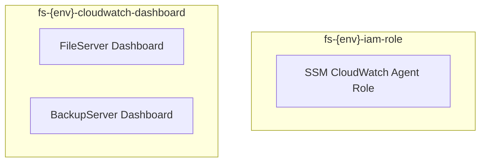

# File Servers CDK Infrastructure

オンプレミスファイルサーバー監視システムの AWS インフラを AWS CDK v2 (TypeScript) で定義する。
旧 `cloudformation/` ディレクトリの YAML テンプレートを CDK 化したもの。

## Overview



## Stacks

| スタック名 | リソース | ファイル |
|-----------|---------|---------|
| `fs-{env}-iam-role` | IAM Role × 1 (SSM + CloudWatch Agent) | `lib/iamRole.ts` |
| `fs-{env}-cloudwatch-dashboard` | CloudWatch Dashboard × 2 (FileServer / BackupServer) | `lib/cloudwatchDashboard.ts` |

## Quick Start

> [!IMPORTANT]
> 前提条件: Node.js 22+、AWS CLI (プロファイル: `FileServers`)、CDK Bootstrap 実行済み。
> AWS アカウント: `856221042201` / リージョン: `ap-northeast-1`。

```bash
cd infra/cdk
npm install
npx cdk bootstrap --profile FileServers
npx cdk deploy -c env=prod --all --profile FileServers
```

## Usage

```bash
# 全スタックを dev / prod でデプロイ
npx cdk deploy -c env=dev --all --profile FileServers
npx cdk deploy -c env=prod --all --profile FileServers

# 特定スタックのみ (--exclusively で依存スタックを巻き込まない)
npx cdk deploy fs-prod-cloudwatch-dashboard -c env=prod --exclusively --profile FileServers

# 差分確認 (デプロイなし)
npx cdk diff -c env=prod --all --profile FileServers

# CloudFormation テンプレート出力
npx cdk synth -c env=prod
```

## Configuration

環境ごとの設定は `config/` ディレクトリで管理する。CloudFormation Parameters は使用しない。

| ファイル | 用途 |
|---------|------|
| `config/types.ts` | 設定の型定義 |
| `config/naming.ts` | 物理名の一元管理 |
| `config/dev.ts` | dev 環境設定 |
| `config/prod.ts` | prod 環境設定 |

主な設定項目:

| 項目 | 内容 |
|------|------|
| `account` | デプロイ先 AWS アカウント ID |
| `region` | デプロイ先リージョン (デフォルト: `ap-northeast-1`) |
| `fileServer.host` / `namespace` | FileServer の CloudWatch Agent ホスト名・名前空間 |
| `backupServer.host` / `namespace` | BackupServer の CloudWatch Agent ホスト名・名前空間 |

## Development

```bash
# TypeScript 型チェック
npx tsc --noEmit

# テスト実行
npm test

# 差分確認
npx cdk diff -c env=dev --all
```

## Project Structure

```text
infra/cdk/
├── bin/
│   └── app.ts                        # App エントリポイント
├── lib/
│   ├── iamRole.ts                    # IAM Role スタック
│   └── cloudwatchDashboard.ts        # CloudWatch Dashboard スタック
├── config/
│   ├── types.ts                      # 環境設定の型定義
│   ├── naming.ts                     # 物理名の一元管理
│   ├── dev.ts                        # dev 環境設定
│   └── prod.ts                       # prod 環境設定
├── tests/
│   ├── unit/stacks.test.ts           # スタックごとのリソース検証
│   ├── integration/cross-stack.test.ts  # 命名整合性 + Outputs 不在検証
│   └── system/synth.test.ts          # 全スタック synth + リソース数検証
├── cdk.json
├── cdk.context.json
├── tsconfig.json
├── jest.config.js
└── package.json
```

## Migration from CloudFormation

旧 `cloudformation/` で稼働中のリソースは `cdk import` で CDK 管理下に移行する。
prod 環境の物理名は既存 CFn リソース名と一致するように `config/naming.ts` で定義済み。

| env | IAM Role | FileServer Dashboard | BackupServer Dashboard |
|-----|---------|----------------------|------------------------|
| prod (既存維持) | `SSMCloudWatchAgentRole` | `FileServer` | `BackupServer` |
| dev (規約準拠) | `fs-dev-iam-role-ssm-cloudwatch-agent` | `fs-dev-cloudwatch-dashboard-fileserver` | `fs-dev-cloudwatch-dashboard-backupserver` |

### 移行手順 (prod, 旧 CFn → CDK)

> [!IMPORTANT]
> 全コマンドは `--profile FileServers` で実行する。事前に `cdk bootstrap` が完了していること。

#### Step 1. 既存 CFn テンプレートに `DeletionPolicy: Retain` を追加

既存スタックを削除してもリソースが残るよう、旧テンプレートをコピーして全リソースに `DeletionPolicy: Retain` を付与する。

```bash
# 既存テンプレートを取得
aws cloudformation get-template --stack-name iam-role \
  --query TemplateBody --output text \
  --profile FileServers > /tmp/iam-role.retain.yml

aws cloudformation get-template --stack-name cloudwatch-dashboard \
  --query TemplateBody --output text \
  --profile FileServers > /tmp/cloudwatch-dashboard.retain.yml

# 各リソースの Type 行直後に DeletionPolicy: Retain を追加 (手動編集または sed)
# 編集後の例 (iam-role.retain.yml):
#   SSMCloudWatchAgentRole:
#     Type: AWS::IAM::Role
#     DeletionPolicy: Retain      # ← これを追加
#     Properties: ...

# 既存スタックを Retain ポリシー付きで update
aws cloudformation update-stack --stack-name iam-role \
  --template-body file:///tmp/iam-role.retain.yml \
  --capabilities CAPABILITY_NAMED_IAM \
  --profile FileServers
aws cloudformation wait stack-update-complete --stack-name iam-role \
  --profile FileServers

aws cloudformation update-stack --stack-name cloudwatch-dashboard \
  --template-body file:///tmp/cloudwatch-dashboard.retain.yml \
  --profile FileServers
aws cloudformation wait stack-update-complete --stack-name cloudwatch-dashboard \
  --profile FileServers
```

#### Step 2. 旧 CFn スタックを削除 (リソースは Retain で残る)

```bash
aws cloudformation delete-stack --stack-name cloudwatch-dashboard --profile FileServers
aws cloudformation wait stack-delete-complete --stack-name cloudwatch-dashboard --profile FileServers

aws cloudformation delete-stack --stack-name iam-role --profile FileServers
aws cloudformation wait stack-delete-complete --stack-name iam-role --profile FileServers
```

削除後、AWS マネジメントコンソールで `SSMCloudWatchAgentRole` / `FileServer` / `BackupServer` がオーファンとして残っていることを確認する。

#### Step 3. `cdk import` で CDK 管理下に取り込む

resource-mapping は `import/` ディレクトリに用意済み。

```bash
cd infra/cdk

# IAM Role を import
npx cdk import fs-prod-iam-role -c env=prod \
  --resource-mapping import/fs-prod-iam-role.mapping.json \
  --force \
  --profile FileServers

# CloudWatch Dashboard を import
npx cdk import fs-prod-cloudwatch-dashboard -c env=prod \
  --resource-mapping import/fs-prod-cloudwatch-dashboard.mapping.json \
  --force \
  --profile FileServers
```

#### Step 4. 差分確認 → 適用

import 直後は CDK template と既存リソースの内容が完全一致しているはずだが、念のため diff で確認する。

```bash
npx cdk diff -c env=prod --all --profile FileServers

# 差分があれば deploy で適用 (--exclusively で他スタックを巻き込まない)
npx cdk deploy fs-prod-iam-role -c env=prod --exclusively --profile FileServers
npx cdk deploy fs-prod-cloudwatch-dashboard -c env=prod --exclusively --profile FileServers
```

#### Step 5. 検証

- [ ] `aws cloudformation describe-stacks --stack-name fs-prod-iam-role` がACTIVEで、`SSMCloudWatchAgentRole` が StackResources に含まれる
- [ ] `aws cloudformation describe-stacks --stack-name fs-prod-cloudwatch-dashboard` で `FileServer` / `BackupServer` が StackResources に含まれる
- [ ] CloudWatch コンソールで両ダッシュボードが従来通り閲覧できる
- [ ] ハイブリッドアクティベーション (オンプレ) のメトリクス送信が継続している
- [ ] `npx cdk diff -c env=prod --all` で no changes

## Tech Stack

| カテゴリ | 技術 |
|---------|------|
| IaC | AWS CDK v2 |
| 言語 | TypeScript 5.9 |
| テスト | Jest 30 + `Template.fromStack()` |
| パッケージ管理 | npm |
